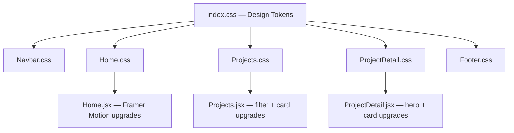
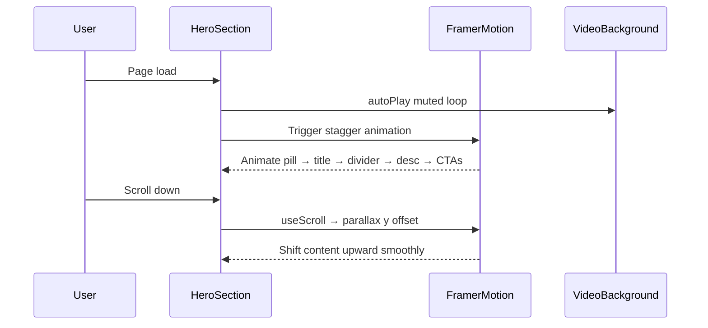

# Design Document: Website Redesign

## Overview

Redesign the Winstone Projects website to move away from the generic "dark luxury real estate" aesthetic (flat black + champagne gold) toward a distinctive, editorial high-end brand identity. The redesign preserves the existing section structure, React component architecture, and CSS-modules-per-file pattern while introducing a new accent palette, modern typography pairing, asymmetric layouts, glassmorphism cards, SVG section dividers, and Framer Motion micro-interactions throughout.

The goal is a site that feels like a premium editorial brand — not a template — while remaining fully responsive and keeping all existing functionality (Supabase contact form, project routing, admin panel) intact.

---

## Architecture

The redesign is purely a **visual layer change**. No routing, data, or backend logic changes. All modifications are confined to:

- `src/index.css` — design token overhaul (new palette, new fonts)
- `src/pages/Home.css` + `Home.jsx` — section-level visual upgrades
- `src/pages/Projects.css` — card and hero upgrades
- `src/pages/ProjectDetail.css` — detail page upgrades
- `src/components/Navbar.css` — navbar visual refresh
- `src/components/Footer.css` — footer visual refresh
- New shared utility classes added to `index.css`



---

## New Visual Identity

### Accent Palette — Midnight Navy + Electric Copper + Warm Cream

The gold/black combination is replaced with a three-tone accent system:

| Token | Value | Usage |
|---|---|---|
| `--accent` | `#C96A3A` | Electric copper — primary CTA, highlights, active states |
| `--accent-light` | `#E8895A` | Lighter copper for hover states and gradients |
| `--accent-dim` | `rgba(201,106,58,0.15)` | Tinted backgrounds, pill badges |
| `--accent-border` | `rgba(201,106,58,0.28)` | Subtle borders |
| `--navy` | `#0B0F1A` | Deep navy background (replaces near-black) |
| `--navy-card` | `#111827` | Card surface |
| `--navy-glass` | `rgba(11,15,26,0.78)` | Frosted glass panels |
| `--cream` | `#F2EDE4` | Warm cream text (replaces cool white) |
| `--cream-muted` | `rgba(242,237,228,0.55)` | Secondary text |

### Typography — Playfair Display + Inter

Replace Cormorant Garamond + DM Sans with a more editorial pairing:

| Role | Font | Weight | Usage |
|---|---|---|---|
| `--font-display` | Playfair Display | 400 / 700 / 900 | Hero titles, section headings |
| `--font-body` | Inter | 300 / 400 / 500 / 600 | Body copy, UI labels, nav |

Playfair Display has stronger contrast between thick and thin strokes, giving a more distinctive editorial feel. Inter is more geometric and modern than DM Sans.

**Typography scale additions:**
- Display hero: `clamp(4rem, 8vw, 7rem)` — dramatically larger than current
- Section titles: `clamp(2.2rem, 4vw, 3.5rem)`
- Overline labels: `0.6rem`, `letter-spacing: 4px`, `font-weight: 700`

---

## Components and Interfaces

### 1. Design Token System (`index.css`)

**Purpose**: Single source of truth for all visual variables.

**New tokens added:**
```css
:root {
  /* New accent — electric copper */
  --accent:         #C96A3A;
  --accent-light:   #E8895A;
  --accent-dim:     rgba(201,106,58,0.15);
  --accent-border:  rgba(201,106,58,0.28);
  --accent-glow:    0 0 40px rgba(201,106,58,0.18);

  /* Deep navy backgrounds */
  --bg-primary:     #0B0F1A;
  --bg-secondary:   #111827;
  --bg-card:        rgba(255,255,255,0.03);
  --bg-glass:       rgba(11,15,26,0.78);

  /* Warm cream text */
  --text-primary:   #F2EDE4;
  --text-secondary: #8A8070;
  --text-muted:     rgba(242,237,228,0.38);

  /* New fonts */
  --font-display:   'Playfair Display', Georgia, serif;
  --font-body:      'Inter', system-ui, sans-serif;

  /* Gradient utilities */
  --grad-accent:    linear-gradient(135deg, #E8895A 0%, #C96A3A 60%, #8B3A1A 100%);
  --grad-surface:   linear-gradient(160deg, #111827 0%, #0B0F1A 100%);
}
```

**Responsibilities:**
- All color, typography, spacing, and easing tokens
- Global reset and base element styles
- Utility classes: `.accent-text`, `.glass-panel`, `.section-pill`, `.btn-primary`, `.btn-ghost`

---

### 2. Navbar (`Navbar.css` / `Navbar.jsx`)

**Purpose**: Fixed top navigation with scroll-aware transparency.

**Visual changes:**
- Scrolled state: `backdrop-filter: blur(24px)` with `--bg-glass` background and a 1px `--accent-border` bottom border
- Logo wordmark: "WINSTONE." in Playfair Display, "PROJECTS" in Inter uppercase tracking
- Nav links: Inter 500, `letter-spacing: 1.5px`, underline reveal on hover using `--accent` color
- CTA button: copper gradient pill with soft inner glow on hover

```css
/* Scrolled state */
.nav-scrolled {
  background: var(--bg-glass);
  backdrop-filter: blur(24px);
  border-bottom: 1px solid var(--accent-border);
  box-shadow: 0 8px 40px rgba(0,0,0,0.5);
}

/* CTA button */
.nav-cta {
  background: var(--grad-accent);
  color: #fff;
  padding: 0.6rem 1.6rem;
  border-radius: var(--radius-pill);
  font-size: 0.8rem;
  font-weight: 600;
  letter-spacing: 0.5px;
  transition: box-shadow 0.3s ease, transform 0.3s ease;
}

.nav-cta:hover {
  box-shadow: 0 0 24px rgba(201,106,58,0.45);
  transform: translateY(-1px);
}
```

---

### 3. Hero Section (`Home.css` / `Home.jsx`)

**Purpose**: Full-viewport video hero with editorial typography and parallax depth.

**Visual changes:**
- Overlay: multi-stop gradient from `rgba(11,15,26,0.72)` at top to `rgba(11,15,26,0.92)` at bottom, plus a radial copper glow at center-left
- Aurora animation: replaced yellow radial with copper + deep teal dual-tone aurora
- Title layout: "Winstone" in Playfair Display 900 at `clamp(4rem, 8vw, 7rem)`, "Projects" in Inter 300 italic below — dramatic weight contrast
- Subtitle pill: frosted glass with `--accent-border`, copper dot pulse
- CTA buttons: primary = copper gradient pill; ghost = glass with cream border
- Scroll indicator: animated chevron with fade-in-out loop

**Framer Motion additions:**
- Hero content: staggered children with `y: 30 → 0`, `opacity: 0 → 1`, 0.15s stagger
- Parallax: `useScroll` + `useTransform` to shift hero content `y` by `-80px` as user scrolls



---

### 4. Section Dividers

**Purpose**: Replace flat horizontal rules with SVG wave/diagonal cuts between sections.

**Implementation**: Inline SVG `<div className="section-divider">` components placed between sections in `Home.jsx`.

```css
.section-divider {
  width: 100%;
  overflow: hidden;
  line-height: 0;
  margin-bottom: -2px; /* prevent gap */
}

.section-divider svg {
  display: block;
  width: 100%;
  height: 60px;
}

/* Diagonal cut variant */
.section-divider--diagonal svg path {
  fill: var(--bg-secondary);
}

/* Wave variant */
.section-divider--wave svg path {
  fill: var(--bg-primary);
}
```

Three divider variants:
1. **Diagonal cut** — between Hero and Impact
2. **Soft wave** — between Partners and Featured Projects
3. **Reverse diagonal** — between About and Companies

---

### 5. Impact / Stats Cards (`Home.css`)

**Purpose**: 4-column stat grid with glassmorphism cards.

**Visual changes:**
- Cards: `background: rgba(255,255,255,0.04)`, `backdrop-filter: blur(12px)`, `border: 1px solid rgba(255,255,255,0.08)`, `border-radius: 16px`
- Top accent line: 2px copper gradient bar at card top
- Icon badge: copper-tinted circle with subtle inner glow
- Hover: `translateY(-6px)` + copper border glow + `box-shadow: var(--accent-glow)`
- Numbers: Playfair Display 700, copper gradient text

```css
.impact-glass-card {
  background: rgba(255,255,255,0.04);
  backdrop-filter: blur(12px);
  border: 1px solid rgba(255,255,255,0.08);
  border-radius: 16px;
  padding: 2rem 1.5rem;
  position: relative;
  overflow: hidden;
  transition: transform 0.4s var(--ease-out), border-color 0.4s ease, box-shadow 0.4s ease;
}

.impact-glass-card::before {
  content: '';
  position: absolute;
  top: 0; left: 0; right: 0;
  height: 2px;
  background: var(--grad-accent);
  opacity: 0.7;
}

.impact-glass-card:hover {
  transform: translateY(-6px);
  border-color: var(--accent-border);
  box-shadow: var(--accent-glow);
}
```

---

### 6. Partners Marquee (`Home.css`)

**Purpose**: Infinite-scroll logo strip.

**Visual changes:**
- Background: `--bg-secondary` with subtle diagonal texture overlay
- Logo cards: glass panels with `backdrop-filter: blur(8px)`, copper border on hover
- Logos: `filter: brightness(0) invert(1)` at 60% opacity → 90% on hover with copper drop-shadow
- Edge fades: gradient from `--bg-secondary` to transparent

---

### 7. Featured Projects Carousel (`Home.css` / `Home.jsx`)

**Purpose**: 3D card stack carousel for featured projects.

**Visual changes:**
- Active card: frosted glass panel with copper top-border accent, `border-radius: 20px`
- Card image: `border-radius: 16px 16px 0 0`, slight inner shadow overlay
- Type badge: copper gradient pill
- Title: Playfair Display 700, cream
- CTA button: copper gradient with arrow icon
- Side cards: increased blur + opacity reduction for depth
- Dots: copper active dot with scale pulse animation

**Framer Motion additions:**
- Card transition: `type: 'spring', stiffness: 280, damping: 30`
- Active card body: `AnimatePresence` with `y: 10 → 0` fade-in on card change

---

### 8. About Section (`Home.css`)

**Purpose**: Split layout — editorial text left, stat cards right.

**Visual changes:**
- Section background: `--bg-secondary` with subtle noise texture
- Left column: large Playfair Display display quote in copper, body in Inter 300
- Value tags: glass pills with copper border on hover, `clip-path` reveal animation
- Right stat cards: glassmorphism with copper icon circles, staggered entrance

**Framer Motion additions:**
- Left column: `x: -40 → 0` slide-in
- Right cards: staggered `y: 20 → 0` with 0.08s delay each
- Value tags: `clip-path: inset(0 100% 0 0) → inset(0 0% 0 0)` reveal on viewport entry

---

### 9. Companies Section (`Home.css`)

**Purpose**: 3-column company cards with image + content.

**Visual changes:**
- Cards: full-bleed image top, glass content panel below
- Image overlay: gradient from transparent to `--bg-card` at bottom
- On hover: image scales `1.06`, content panel slides up `4px`, copper border appears
- Label badge: copper gradient pill top-left of image
- "View on Instagram" link: copper with arrow, underline reveal

---

### 10. Awards Section (`Home.css`)

**Purpose**: 2-column award cards grid.

**Visual changes:**
- Cards: left copper accent bar (4px), glass background, `border-radius: 12px`
- Year badge: copper outline pill
- Trophy icon: copper circle with soft glow
- Card hover: `translateY(-4px)` + copper border + left bar brightens

---

### 11. Founder / Leadership Section (`Home.css`)

**Purpose**: Split layout — photo left, bio right.

**Visual changes:**
- Photo frame: `border-radius: 20px`, copper border, subtle outer glow
- Quote box: glass panel with copper left border, Playfair Display italic
- Bio text: Inter 300, generous line-height
- Quality pills: glass with copper hover

---

### 12. Contact Form (`Home.css`)

**Purpose**: Enquiry form with glass card styling.

**Visual changes:**
- Form card: `background: rgba(255,255,255,0.03)`, `backdrop-filter: blur(20px)`, copper top border
- Inputs: `background: rgba(255,255,255,0.04)`, `border: 1px solid rgba(255,255,255,0.1)`, copper focus ring
- Submit button: copper gradient, full-width, soft glow on hover
- Success/error states: animated toast with copper/green accent

---

### 13. Projects Page (`Projects.css`)

**Purpose**: Hero + filter tabs + 3-column card grid.

**Visual changes:**
- Hero: diagonal clip-path bottom edge, copper radial glow
- Filter tabs: glass pills, copper active state with gradient background
- Project cards: glass surface, copper type badge, image zoom on hover, copper CTA button
- Card hover: `translateY(-6px)` + copper border glow

---

### 14. Project Detail Page (`ProjectDetail.css`)

**Purpose**: Single project and multi-project detail layouts.

**Visual changes:**
- Back button: glass pill with copper hover
- Single project hero: split grid, image with copper border-radius frame
- Meta boxes: glass panels with copper label icons
- Highlight pills: glass with copper check icon, hover reveal
- Download/CTA buttons: copper gradient

---

### 15. Footer (`Footer.css`)

**Purpose**: 3-column footer with brand, links, contact.

**Visual changes:**
- Top divider: copper gradient bar (2px)
- Background: `#060A12` (slightly bluer than current)
- Column titles: Inter 700, `letter-spacing: 3px`, copper underline
- Social icons: glass squares, copper on hover
- Bottom bar: subtle separator, muted cream text

---

## Data Models

No data model changes. All existing Supabase schemas, project data structures, and component props remain identical.

---

## Correctness Properties

*A property is a characteristic or behavior that should hold true across all valid executions of a system — essentially, a formal statement about what the system should do. Properties serve as the bridge between human-readable specifications and machine-verifiable correctness guarantees.*

### Property 1: Vendor Prefix Completeness

*For any* CSS rule in the redesigned stylesheets that declares `backdrop-filter`, that same rule SHALL also declare `-webkit-backdrop-filter` with an equivalent value.

**Validates: Requirements 16.2**

### Property 2: Interactive Element Focus Visibility

*For any* interactive element (button, anchor, or input) rendered in the redesigned pages, that element SHALL have a non-default, visually distinct focus style defined — using the copper accent color — so that keyboard navigation remains accessible.

**Validates: Requirements 16.3**

---

## Error Handling

### Font Load Failure
**Condition**: Google Fonts CDN unreachable  
**Response**: `font-family` stacks fall back to `Georgia, serif` and `system-ui, sans-serif`  
**Recovery**: No action needed — fallbacks are visually acceptable

### Video Background Failure
**Condition**: `hero-bg.mp4` fails to load  
**Response**: `poster` attribute shows static image; `--bg-primary` background color visible  
**Recovery**: No action needed — existing fallback already in place

### `backdrop-filter` Unsupported
**Condition**: Browser (e.g. older Firefox) doesn't support `backdrop-filter`  
**Response**: Glass panels fall back to solid `--bg-card` background via `@supports` check  
**Recovery**: Automatic via CSS feature query

---

## Testing Strategy

### Visual Regression
- Manually verify each section at 1440px, 1024px, 768px, 375px breakpoints
- Confirm no text overflow, broken grid layouts, or clipped elements

### Animation / Interaction
- Verify Framer Motion stagger animations trigger correctly on viewport entry
- Confirm parallax effect on hero doesn't cause scroll jank
- Test carousel navigation (prev/next/dot) with new card styles
- Verify hover states on cards, buttons, nav links

### Accessibility
- Keyboard tab order through nav, hero CTAs, form, footer links
- Confirm focus rings visible with new copper accent
- Test with `prefers-reduced-motion: reduce` — all animations should be disabled or minimized

### Cross-Browser
- Chrome, Firefox, Safari (desktop + mobile)
- Confirm `backdrop-filter` fallback in Firefox
- Confirm `-webkit-backdrop-filter` in Safari

### Performance
- Confirm new Google Fonts import doesn't increase LCP significantly (`display=swap`)
- Verify no layout shift from font swap (reserve space with `size-adjust` if needed)

---

## Performance Considerations

- SVG section dividers are inline — no additional HTTP requests
- New font weights loaded: Playfair Display (400, 700, 900) + Inter (300, 400, 500, 600) — comparable to current load
- `backdrop-filter: blur()` is GPU-accelerated; limit to cards/navbar only (not full-page overlays) to avoid paint cost
- Framer Motion `whileInView` uses `IntersectionObserver` — no scroll listener overhead
- Marquee animation uses CSS `transform: translateX` — compositor-only, no layout recalculation

---

## Security Considerations

No security-relevant changes. This is a pure visual/CSS redesign. All existing Supabase RLS policies, form validation, and admin authentication remain unchanged.

---

## Dependencies

No new npm packages required. All capabilities are available via existing stack:

| Dependency | Already Installed | Usage in Redesign |
|---|---|---|
| Framer Motion | ✅ | Parallax (`useScroll`, `useTransform`), stagger, `AnimatePresence` |
| Lucide React | ✅ | Icons in cards, buttons, meta boxes |
| Google Fonts | ✅ (via CDN) | Add Playfair Display + Inter to existing `@import` |
| CSS Custom Properties | ✅ (native) | All new design tokens |
| SVG | ✅ (native) | Section dividers inline |
